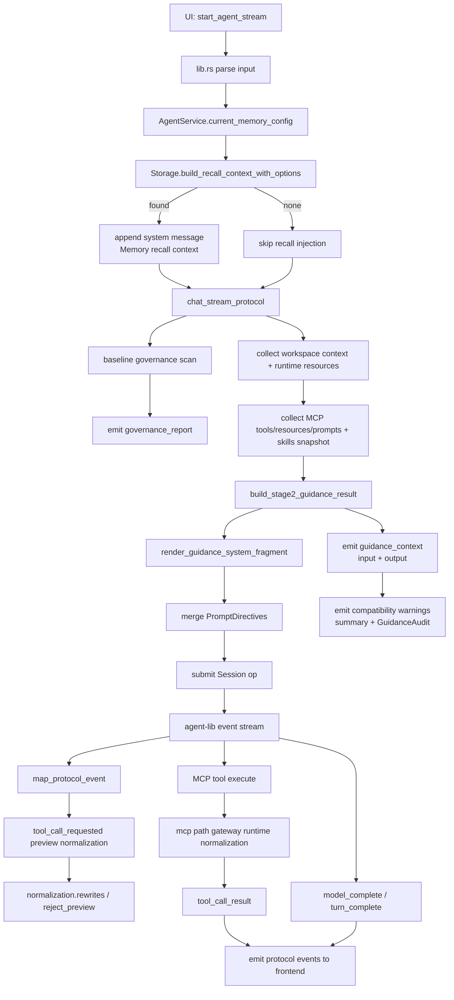

# AI Desktop Assistant

桌面端 AI 助手应用，`agent-lib` 为核心推理与工具执行引擎。

## Repository Strategy

- 本项目是独立 Git 仓库（不要与 `agent-lib` 混提或混发版本）。
- 本地联调固定使用 path 依赖：
  - `src-tauri/Cargo.toml` -> `agent-lib = { path = "../../agent-lib" }`
- 不要给 `agent-lib` 依赖追加 `features = [...]`。

## Run Locally

1. 配置最小环境变量（OpenAI 默认）：
   - `OPENAI_API_KEY=...`
2. 可选运行时覆盖：
   - `AGENT_PROVIDER=openai|glm|glm_coding|anthropic|local`
   - `AGENT_MODEL=...`
   - `AGENT_API_KEY_ENV=OPENAI_API_KEY|GLM_API_KEY|...`
   - `AGENT_SYSTEM_PROMPT=...`
   - `AGENT_MEMORY_CONFIG_JSON=...`（见下方示例）
3. 启动：
   - `cd src-tauri`
   - `cargo tauri dev`

## Memory Config (Stage3)

`AGENT_MEMORY_CONFIG_JSON` 示例：

```json
{
  "enabled": true,
  "maxRecallItems": 8,
  "maxNonSecretItems": 3,
  "maxSecretItems": 2,
  "secretSimilarityThreshold": 0.82,
  "requireExplicitSecretIntent": true
}
```

## End-to-End Workflow (Stage2 + Stage3)



## Stage2 Guidance Notes

- 每轮先构建结构化指导结果，再渲染系统提示片段，不再直接拼原始字符串。
- 指导输入包含：
  - workspace `.ah` 路径上下文
  - MCP tools/resources/prompts 快照
  - skills
  - governance 摘要
  - memory 摘要（脱敏）
- 协议新增 `guidance_context` 事件，同时保留旧 `warning` 兼容前端。

## MCP 参数治理可观测性

- `tool_call_requested` 增加 `normalization`（可选）：
  - `rewrittenCount`
  - `rewrites[]`（字段路径、原因、前后值）
  - `rejectPreview`（字段路径、拒绝原因）
- 该字段是预览观测，不改变实际执行语义。
- 真正执行仍由 MCP runtime path gateway 做最终规范化与拒绝。

## Secret & Redaction Rules

- secret 仅允许在内部 recall 系统消息中注入（受意图门控与阈值控制）。
- guidance 结构化事件和提示摘要必须脱敏（`<redacted>`），禁止明文 secret 泄漏。
- secret 注入会写入审计表（`secret_injection_audit`）。

## Protocol Events (新增重点)

- `governance_report`
- `guidance_context`
- `tool_call_requested`（含可选 `normalization`）
- 其他事件保持兼容：`warning`, `error`, `tool_call_result`, `model_complete` 等。

## Validation Baseline

- `cd src-tauri && cargo check`
- `cd src-tauri && cargo test`
- `cd frontend && pnpm lint`
- `cd frontend && pnpm build`

## Promotion To Git Tag Dependency

当 `agent-lib` 稳定后：

1. 在 `agent-lib` 打 tag，例如 `v0.1.0`。
2. 将依赖从 path 改为 git + tag：

```toml
agent-lib = { git = "https://<your-host>/<org>/agent-lib.git", tag = "v0.1.0" }
```

3. 仍不要添加 `features = [...]`。
